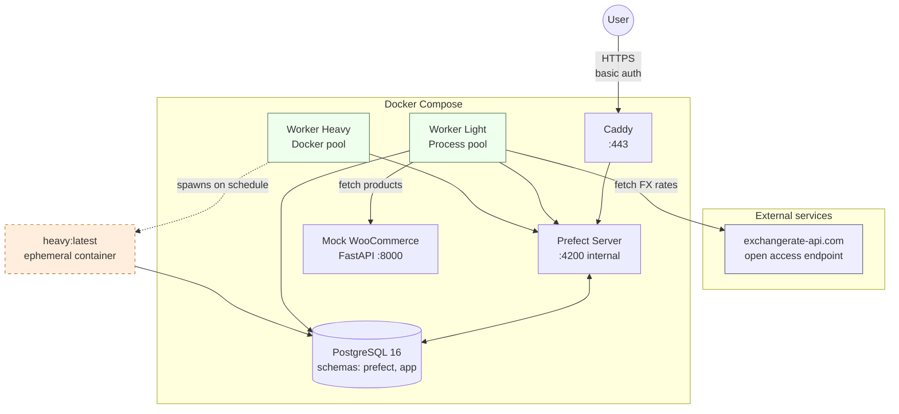
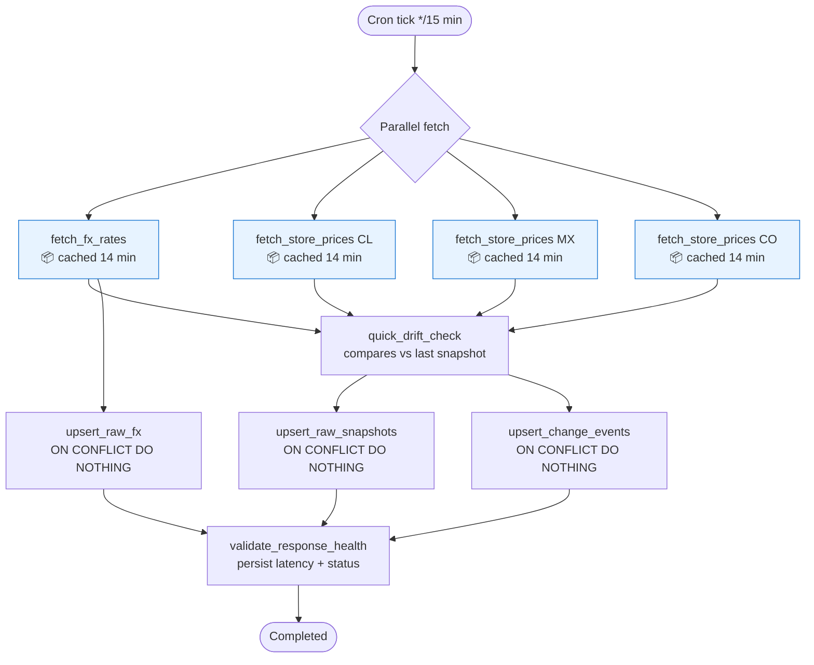
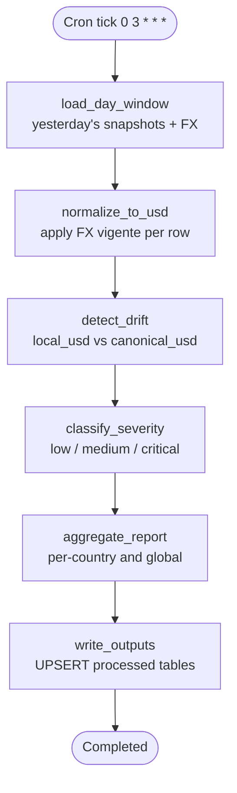
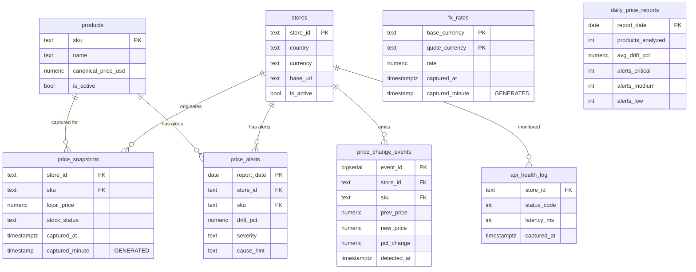
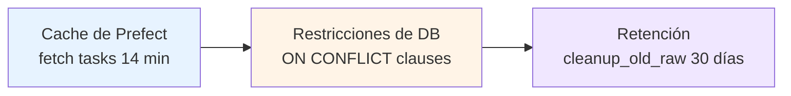

# Multi-country price sync

Pipeline de sincronización y monitoreo de precios para una compañía de educación online con presencia multi-país (Chile, México, Colombia). Captura precios locales y tipos de cambio con frecuencia, consolida diariamente y detecta drift contra precios canónicos en USD, clasificando alertas por severidad.

Construido sobre **Prefect 3 + Postgres 16 + Docker Compose**, con dos pipelines independientes (uno liviano cada 15 minutos y uno pesado diario) acoplados por base de datos.

---

## Tabla de contenidos

- [Multi-country price sync](#multi-country-price-sync)
  - [Tabla de contenidos](#tabla-de-contenidos)
  - [Problema y contexto](#problema-y-contexto)
  - [Arquitectura](#arquitectura)
  - [Stack técnico](#stack-técnico)
  - [Pipelines](#pipelines)
    - [Liviano](#liviano)
    - [Pesado](#pesado)
  - [Modelo de datos](#modelo-de-datos)
  - [Idempotencia](#idempotencia)
  - [Aislamiento del pipeline pesado](#aislamiento-del-pipeline-pesado)
  - [Cómo levantarlo — local](#cómo-levantarlo--local)
  - [Cómo levantarlo — VM](#cómo-levantarlo--vm)
  - [Cómo verificar que funciona](#cómo-verificar-que-funciona)
  - [Estructura del repo](#estructura-del-repo)
  - [Decisiones técnicas](#decisiones-técnicas)
  - [Trade-offs y deuda técnica](#trade-offs-y-deuda-técnica)
  - [Segunda iteración](#segunda-iteración)

---

## Problema y contexto

La compañía vende productos educativos a través de WooCommerce en tres países. Cada store tiene precios denominados en moneda local (CLP, MXN, COP) y un precio canónico en USD definido por el catálogo. Por movimiento de tipo de cambio o por errores de operación, los precios locales pueden desviarse del canónico — un drift sostenido implica pérdida de margen en un país o pérdida de competitividad en otro.

Este sistema:

- **Captura** precios y FX cada 15 minutos.
- **Detecta** cambios bruscos de precio (>5%) en tiempo casi-real.
- **Consolida** una vez al día las desviaciones contra el canónico USD, clasificándolas por severidad.

La mecánica corresponde a uno de los problemas sugeridos por el equipo evaluador: *"sincronizar precios entre los WooCommerce de Chile, México y Colombia: aplicar tipo de cambio, detectar diferencias, alertar"*.

---

## Arquitectura



**Componentes**:

- **Postgres 16**: una sola instancia, dos schemas. `prefect` para metadatos del orquestador, `app` para los datos de negocio.
- **Prefect Server**: API + UI en `:4200`. Expuesto solo internamente.
- **Caddy**: reverse proxy con TLS automático (Let's Encrypt) y basic auth.
- **Worker Light**: Process pool, ejecuta el flow liviano dentro del mismo contenedor.
- **Worker Heavy**: Docker pool. **No ejecuta el flow** — spawnea un contenedor efímero `heavy:latest` por cada run y delega.
- **Mock WooCommerce**: FastAPI que simula los 3 stores reales, con drift configurable y determinismo opt-in.

---

## Stack técnico

| Capa | Tecnología | Versión |
|---|---|---|
| Lenguaje | Python | 3.12 |
| Package manager | uv | latest |
| Orquestador | Prefect | 3.6.29 |
| Base de datos | PostgreSQL | 16 |
| ORM + migraciones | SQLAlchemy + Alembic | 2.0 + 1.13 |
| DB driver | psycopg | 3.2 |
| Cliente HTTP | httpx | 0.28 (async) |
| Mock API | FastAPI + uvicorn | 0.115 + 0.32 |
| Config tipada | pydantic + pydantic-settings | 2.10 + 2.7 |
| Procesamiento pesado | pandas | 2.2 |
| Tests | pytest + pytest-asyncio | 8.3 + 0.24 |
| Lint + format | ruff | 0.9 |
| Reverse proxy | Caddy | 2.x |
| Containers | Docker + Compose | latest |

**¿Por qué Prefect y no Airflow?** Prefect 3 ofrece un sistema nativo de caché por inputs, soporte de primera clase para flows asíncronos (clave para paralelizar las llamadas a los 3 stores), modelo de despliegue work-pool/worker más simple que el scheduler de Airflow, y un DX mucho más bajo en boilerplate. Tomando en cuenta mi falta de conocimiento en el despliegue de estos flujos se opto por usar el modelo mas pytonico de Prefect y la curva de aprendizaje menos empinada

---

## Pipelines

### Liviano

**Schedule**: cron `*/15 * * * *` (cada 15 minutos).
**Pool**: Process. **Duración objetivo**: 5–15 segundos.



**Decisiones clave**:

- Los 4 fetches corren en paralelo con `asyncio.gather`. La duración del flow es la del fetch más lento, no la suma.
- La caché de Prefect (`cache_policy=INPUTS`, `cache_expiration=14min`) absorbe re-triggers manuales y cubre la ventana entre crons consecutivos. Si manualmente disparas dos runs en menos de 14 min, los fetches ya hechos vienen de caché — visibles en la UI con el badge `Cached`.
- El drift check corre **antes** del upsert: necesita ver el snapshot anterior, no el actual.
- El health log queda fuera del path crítico, garantizando registro incluso si los upserts fallan.

### Pesado

**Schedule**: cron `0 3 * * *` (diario, 3 AM UTC).
**Pool**: Docker. Spawnea contenedor `heavy:latest`. **Duración objetivo**: 30–60 segundos.



**Encadenamiento con el liviano**: acoplamiento por base de datos, sin trigger directo. El pesado consume `app.price_snapshots` y `app.fx_rates` filtrando por `date(captured_at) = yesterday`. Esto desacopla los ciclos de vida: si el liviano falla un cron, el pesado igual procesa lo que haya. Si el pesado falla, el liviano sigue capturando.

**Decisiones clave**:

- **Pandas en lugar de SQL puro** para `normalize_to_usd` y `aggregate_report`: el join temporal con FX (asignar a cada snapshot el FX vigente al momento de captura) es expresable como `merge_asof` en una línea; la versión SQL pura requeriría una window function correlacionada.
- **UPSERT en outputs**: re-correr el pesado del mismo día reemplaza el reporte y las alertas, no las duplica.

---

## Modelo de datos



**Sobre `captured_minute`**: columna generada `STORED` con expresión `date_trunc('minute', captured_at AT TIME ZONE 'UTC')`. La expresión es `IMMUTABLE`, requisito de Postgres para indexarla y usarla en restricciones únicas. Esta columna es la clave del mecanismo de idempotencia: dos snapshots del mismo `(store_id, sku)` en el mismo minuto colapsan en uno.

**Migraciones**: Alembic, una sola revisión inicial `0001_initial_schema.py` que crea el schema `app`, todas las tablas, las restricciones y carga seed mínimo de `products` y `stores`.

---

## Idempotencia

Tres capas independientes que se refuerzan:



**1. Caché de Prefect en tasks costosas del liviano.** Re-disparar el flow dentro de la misma ventana de 14 minutos devuelve resultados cacheados, sin pegarle al store ni a la API de FX. La caché se invalida si cambian los inputs de la task (gracias a `cache_policy=INPUTS`) o si pasan 14 minutos.

**2. Restricciones de DB**:
- **Raw**: `INSERT ... ON CONFLICT (store_id, sku, captured_minute) DO NOTHING`. Los snapshots y FX rates se persisten una sola vez por minuto por par.
- **Processed**: `INSERT ... ON CONFLICT (report_date, store_id, sku) DO UPDATE`. Re-correr el pesado del mismo día reemplaza el reporte.

**3. Retención** (`cleanup_old_raw`): elimina raw con más de 30 días al final del pesado. Configurable y desactivable vía variable de entorno.

Esta arquitectura de tres capas significa que **cualquiera de los pipelines puede ser disparado N veces sin riesgo**: la caché evita trabajo redundante, las restricciones evitan filas duplicadas, la retención mantiene la base manejable.

---

## Aislamiento del pipeline pesado

El requisito explícito es que las dependencias pesadas (pandas) no contaminen el contenedor del orquestador. La solución elegida:

- **Imagen base** `prefect-base.Dockerfile`: incluye `prefect-client` y libs livianas (httpx, pydantic, sqlalchemy, fastapi). Usada por server, worker liviano y worker pesado.
- **Imagen heavy** `heavy.Dockerfile`: extiende la base sumando `pandas`. Construida una vez por compose, ejecutada **on-demand** por el Docker work pool.
- **Worker heavy**: corre permanentemente con la imagen base (delgada). Cuando llega un run, lanza un contenedor efímero con la imagen `heavy:latest`, que ejecuta el flow y muere al terminar.

**Por qué Docker work pool y no entornos virtuales separados**: aísla no solo dependencias Python sino el filesystem completo, recursos del kernel y fallos catastróficos (un OOM en pandas no tira el orquestador). Es la frontera de aislamiento más limpia disponible sin saltar a Kubernetes.

Verificable durante una run con `docker ps`: aparece un contenedor `heavy:latest` durante 30–60 segundos y desaparece.

---

## Cómo levantarlo — local

**Requisitos**: Docker, Docker Compose, uv. Probado en Linux y macOS.

```bash
# 1. Clonar y configurar entorno
git clone <repo-url>
cd multi-country-price-sync
cp .env.example .env

# 2. Levantar todo
docker compose up -d --build

# 3. Aplicar migraciones (la primera vez)
docker compose exec prefect-server alembic upgrade head

# 4. Cargar seed de catálogo
docker compose exec prefect-server bash scripts/seed_db.sh

# 5. Registrar deployments
PREFECT_API_URL=http://localhost:4200/api uv run python -m src.deploy.deploy_light
PREFECT_API_URL=http://localhost:4200/api uv run python -m src.deploy.deploy_heavy

# 6. Abrir UI
open http://localhost:4200
```

A partir de aquí, el cron `*/15 * * * *` dispara el liviano automáticamente. Para forzar una corrida inmediata: UI → Deployments → `light-price-sync` → `Run` → `Quick run`.

---

## Cómo levantarlo — VM

> **⚠️ Estado del despliegue público**: Se esta trabajando en el despliegue publico ha generado mas problemas de los planteados por lo que una vez este listo se deja time stamp y url valida de acceso

**URL pública**: `<URL_VM>`
**Credenciales**: usuario y password pasados en un correo adicional.

**Provisión** (Hetzner CX23, Ubuntu 24.04):

```bash
# En la VM como root, después de SSH
curl -fsSL https://get.docker.com | sh
systemctl enable --now docker

# Clonar repo y configurar producción
git clone <repo-url>
cd multi-country-price-sync
# Subir .env.production por scp desde el host
docker compose --env-file .env.production -f docker-compose.yml -f docker-compose.prod.yml up -d --build

# Migraciones, seed y deployments
docker compose exec prefect-server alembic upgrade head
docker compose exec prefect-server bash scripts/seed_db.sh
docker compose exec prefect-worker-light python -m src.deploy.deploy_light
docker compose exec prefect-worker-heavy python -m src.deploy.deploy_heavy
```

El override `docker-compose.prod.yml` añade el servicio `caddy` con TLS automático contra Let's Encrypt y basic auth.

**Script automatizado**: `scripts/deploy_vm.sh` empaqueta toda la secuencia de arriba.

---

## Cómo verificar que funciona

**1. UI de Prefect responde**:
```bash
curl -I http://localhost:4200
# Esperado: 200 o 307
```

**2. Tablas pobladas**:
```bash
docker compose exec postgres psql -U pipelines -d pipelines -c "
SELECT 'snapshots' AS t, COUNT(*) FROM app.price_snapshots
UNION ALL SELECT 'fx_rates', COUNT(*) FROM app.fx_rates
UNION ALL SELECT 'health',   COUNT(*) FROM app.api_health_log
UNION ALL SELECT 'events',   COUNT(*) FROM app.price_change_events
UNION ALL SELECT 'reports',  COUNT(*) FROM app.daily_price_reports
UNION ALL SELECT 'alerts',   COUNT(*) FROM app.price_alerts;
"
```

Tras una corrida del liviano: `snapshots ≥ 8`, `fx_rates ≥ 3`, `health = 4`. Tras una corrida del pesado: `reports ≥ 1`, `alerts ≥ 0`.

**3. Caché funcional**: dispara `light-price-sync` dos veces dentro del mismo minuto. En el grafo de la segunda run, las tasks `fetch_fx_rates` y `fetch_store_prices-*` aparecen con badge **Cached** en lugar de Completed.

**4. Idempotencia raw**: corre la misma query del paso 2 antes y después de re-disparar el liviano dentro del mismo minuto. Los conteos de `snapshots` y `fx_rates` no aumentan (`captured_minute` colapsa). `health` sí aumenta (no es cacheada por diseño).

**5. Idempotencia processed**: dispara el pesado dos veces el mismo día. `daily_price_reports` mantiene una fila por `report_date` (UPSERT reemplaza, no duplica).

**6. Aislamiento del pesado**: durante una corrida del heavy, en otra terminal:
```bash
watch -n 1 'docker ps --filter ancestor=heavy:latest'
```

Aparece el contenedor efímero durante la run, desaparece al terminar.

**7. Tests**:
```bash
uv run pytest tests/unit/      # rápido, sin DB
uv run pytest tests/integration/  # requiere docker compose up
```

---

## Estructura del repo

```
.
├── README.md
├── docker-compose.yml             # base
├── docker-compose.prod.yml        # override con Caddy + basic auth
├── .env.example
├── pyproject.toml
├── uv.lock
│
├── docker/
│   ├── prefect-base.Dockerfile    # base liviana, sin pandas
│   ├── heavy.Dockerfile           # extiende base con pandas
│   └── mock-woocommerce.Dockerfile
│
├── caddy/
│   └── Caddyfile
│
├── src/
│   ├── pipelines/
│   │   ├── light/                 # flow liviano
│   │   └── heavy/                 # flow pesado
│   ├── shared/
│   │   ├── config.py              # pydantic-settings
│   │   ├── db.py                  # engine + session factory
│   │   ├── http_clients.py        # httpx async clients
│   │   ├── models.py              # SQLAlchemy declarative
│   │   └── schemas.py             # pydantic DTOs
│   ├── mock_woocommerce/          # FastAPI mock
│   └── deploy/                    # registro de deployments
│
├── migrations/                     # Alembic
├── scripts/                        # bootstrap, seed, deploy_vm
├── reports/queries.sql             # queries pre-armadas para verificar
└── tests/                          # unit + integration
```

---

## Decisiones técnicas

**Async para HTTP, sync para DB**. Las llamadas a los 3 stores y al FX provider corren en paralelo con `asyncio.gather` — async paga su costo aquí. Los writes a Postgres son ráfagas cortas; el sync con psycopg + pool da código más simple sin penalizar latencia. Mezclar ambos no genera fricción en Prefect 3.

**FX provider sin API key**. Usamos el endpoint *Open Access* de exchangerate-api.com (`open.er-api.com/v6/latest/USD`), que no requiere autenticación. El endpoint Standard con key tiene 1500 req/mes de free tier — insuficiente para un cron `*/15` (≈2880 req/mes). Trade-off: el Open Access no garantiza SLA; en producción real se migraría a un plan pagado o a un agregador.

**`text()` con SQL crudo en lugar del ORM para writes**. Los upserts con `ON CONFLICT` son específicos de Postgres y la sintaxis directa es más legible que el equivalente con `pg_insert`. Las queries de lectura del pesado sí usan SQLAlchemy + pandas para aprovechar `merge_asof`.

**Schema `app` separado del schema `prefect`**. Prefect crea sus tablas en `public` por default; aislamos las nuestras en `app` para que un wipe de metadatos del orquestador no toque nuestros datos.

**Mock WooCommerce con drift simulado**. Cada llamada al mock añade ruido ±2% al precio base, y con baja probabilidad un cambio mayor. Determinismo opt-in vía header `X-Mock-Seed` para tests reproducibles. Esto da material realista a `quick_drift_check` y `detect_drift` sin necesitar stores reales.

---

## Trade-offs y deuda técnica

**Conscientes y aceptados**:

- **Sin retries por job en Prefect**, solo a nivel de task. Prefect 3 lo soporta a ambos niveles, pero para pipelines de minutos no agregaba valor real frente a la complejidad.
- **Cleanup de raw configurable pero no monitoreado**. Si se desactiva, el crecimiento es lineal con el tiempo. Producción real necesitaría una métrica de tamaño de tabla y alerta.
- **Sin dead-letter queue** para fetches fallidos. Si los 3 stores fallan al mismo tiempo, perdemos esa ventana de captura. Aceptable porque el liviano es de alta frecuencia (otra ventana en 15 min) y el pesado tolera huecos.
- **Logs en stdout, sin agregador externo**. Prefect UI cubre observabilidad de flows; para producción real se sumaría Loki, Datadog o equivalente.
- **Sin despliegue actualmente en VM accesible** debido a tiempo y falta de conocimiento no se ha logrado desplegar correctamente en un servidor accesible web

**Deuda técnica explícita**:

- El header `X-Mock-Seed` es solo para el mock, irrelevante en producción real.
- El cleanup elimina pero no archiva. Una versión productiva movería a almacenamiento frío (S3 / Postgres archive table) en lugar de borrar.
- La autenticación del UI usa basic auth en Caddy aun en validacion de funcionamiento

---

## Segunda iteración

Si tuviera otro bloque de tiempo:

1. **Notificaciones reales** vía Prefect automations: webhook a Slack con resumen de alertas críticas al cierre del pesado.
2. **Backfill controlado**: comando CLI para re-procesar un rango de fechas, útil cuando el pesado falla varios días seguidos.
3. **Métricas de observabilidad**: contadores Prometheus para tasa de drift detectado, latencia p95 por store, antigüedad del último FX persistido.
4. **Tests de propiedades** sobre `detect_drift` y `classify_severity` con Hypothesis: en lugar de casos cerrados, generar inputs aleatorios con invariantes.
5. **Dashboard de negocio**: Grafana sobre las tablas processed, no para reemplazar la UI de Prefect sino para que el equipo no-técnico vea drift por país sin abrir Postgres.
6. **Multi-tenant**: extender el modelo a más países sin cambios de schema, parametrizando `stores` en runtime.
7. **Health checks integrados al CI**: cuando el liviano detecta degradación sostenida (p95 latency > umbral por N runs consecutivos), abrir un issue automáticamente.
8. **Sustituir el mock por contratos reales**: usar grabaciones VCR de las APIs reales en testing, mantener el mock solo como sandbox local.
9. **Validacion de todos los flujos a detalle** aprovechar el tiempo extra para validar cada flujo correctamente y no solo apoyado en IA como es el caso de heavy para asegurar que la data cargada y guardada es realmente concluyente
